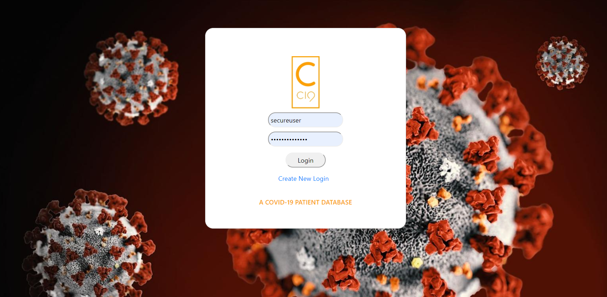

# C-19 A COVID-19 Patient Database

## INTRODUCTION

As a physician I would like easy access to COVID-19 patient results across the country to ensure accurate tracking and reporting of tested patients.

## DEPLOYMENT LINK

 

## TABLE OF CONTENTS

1. [FEATURES](#features)
2. [INSTALLATION](#installation)
3. [CONTRIBUTIONS](#contributions)
4. [PREVIEW](#preview)
5. [RESOURCES](#resources)
6. [BADGES](#badges)
7. [QUESTIONS](#QUESTIONS)

 

## FEATURES

1. Users are able to login to patient database by providing their email and password.
    * Or users can signup for access

2. Users can search for existing patients or add a new one with the following information:

    a. Id #

    b. Patient fist and last name

    c.  Phone no.

    d. City

    e. Symptoms
    
    f. Infection status

    g. Treatment

    h. Admission status

    i. Doctor

3. If a specific patient needs to be removed, a button is available to do so.

4. Upon logging out, users can access the CDC website or choose to return to login page.

 

## INSTALLATION

1. To use the application, install (npm install) the following dependencies:

    a. **bycryptjs:** Allows passwords to be hashed

    b.  **bootstrap-vue:** Front-end framework works with Vue.js

    c.  **core-js:** Modular standard library for JavaScript

    d.  **express:** Node.js framework
    
    e.  **express-handlebars:** Allows server-side manipulation of HTML ("templating engine")

    f. **mysql2:** Used with sequelize; allows access to MySQL database.

    g. **routes:** Translates each incoming HTTP request to an action call (static, public method in controller class)

    h.  **sequelize:** ORM designed for Node; allows for handling complex SQL database queries with JavaScript methods

    i.  **vue:** A progressive javascript framework for building user interfaces

    j. **vue-router:** Allows users to switch between pages without refreshing.

2. Users will need to install mySQL in order to create a database.

3. Users should enter their own personal mySQL password in the connection.js file. 

 

## CONTRIBUTORS

Grant Kyle

Kendra Kwoka

Leandra Turner

 

## PREVIEW

 

## RESOURCES

*C19 Logo Maker*: 

www.tailorbrands.com

*COVID-19 Background*

www.kctv5.com

 

## QUESTIONS
​

​
If you have any questions about the repo, contact [kkwoka](https://github.com/kkwoka).

